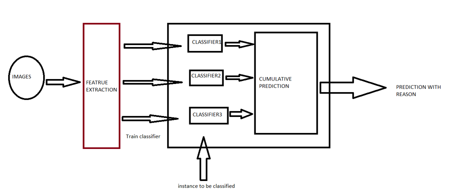

```{r setup, include=FALSE}
knitr::opts_chunk$set(echo = TRUE)
```

# Project Title: COVID-19 Prediction using Explainable Machine Learning

## Team:

#### Jalaj, Vora
M.Sc. Digital Engineering <br>

#### Shivam, Singh
M.Sc. Digital Engineering <br>

#### Subhankar, Patra
M.Sc. Data and Knowledge Engineering <br>

#### Subhajit, Mondal
M.Sc. Data and Knowledge Engineering <br>

#### Roshmitha, Thummala
M.Sc. Data and Knowledge Engineering <br>

***

## Background and Motivation:

The COVID-19 or the SARS-COV2 possibly originated from the district of Wuhan, China has transpired to be a pandemic worldwide. Research on the COVID-19 is a hot topic among the Artificial Intelligence community recently. Particularly this is in line with our motivation towards building a classifier that predicts the presence or absence of COVID19 in a patient from chest X ray or CT scan. The project tries to finds insights of COVID-19 detection using simpler explainable models and effectively use the research surrounding the virus. The proposal describes categorically the following points, viz. the feature extraction and selection areas, models that are to be used, fusion techniques that can be employed, overall architecture of the system to be built.

***

## Ground Truth and Technology Stack:

The project shall be built using `R` and related `R` based API’s like `shiny`,  `magick`, `opencv`.
We may try to emphasize more on the grounds of explainable machine learning, by means of both trying classifiers like the SVM and using the much complex self-representation power using the Neural Nets.

### Dataset
We may try to learn from chest X-Rays or CT-scan images. However, as literature surveys suggest, CT-scans transfer much knowledge and thus is better suitable Deep learning-based approaches, X-Rays on the other hand are cheap source and, in much abundance, than CT-scans and gives good results on the fronts of vision tasks. Both Deep learning-based approach and features extraction using computer vision can be done from them. We may for reasons of abundance of data try to stick to X-Ray images.<br>
In particular we may try to use the [COVIDx](https://github.com/rezacsedu/DeepCOVIDExplainer) dataset as was used in “DeepCOVIDExplainer: Explainable COVID-19 Predictions Based on Chest X-ray Images”.

***

## Data Science Pipeline Design Overview

### Feature Extraction and Selection
For the part of feature extraction, we shall try texture-based descriptors. There exist several texture-based vision algorithms. We might combine features before training and train our model on a combined feature set. Or we can train models on individual features, and then combine prediction results might be combined and thus one feature might only not be selected but multiple features can be selected. <br>
Literature survey tells us Local Binary Patterns shall be a good choice for texture-based descriptor. We may also try to use pretrained networks to gain texture descriptors or vision API’s for the extraction part. <br>
Moreover, there are several neural nets we faced in literature survey, that are carefully curated for the purpose of the COVID-19, which requires the image to directly fed to the net, and thereby auto encodes the parameters.

### Models to train and aim of the project
The problem in hand is a classification problem where we can either classify an image as positive or negative. Here we would like to emphasize that the model won’t predict presence or absence or pneumonia, which is a result not only of COVID-19 but other kind of reasons also affect this. <br>

We mainly will try two kinds of algorithms:

1. One that can be trained based on features to be extracted, like clustering, SVM, binary classification (regression). Mostly because the models are intrinsically explainable.

2. Neural Net based approaches, where the model is a black box model, and we use tools like saliency maps for description.

### Overview of Design



The overall architecture of the system is like the above… where we have images and we extract features from them or do certain preprocessing such as cropping of image etc. Then the features or preprocessed images are fed to the classifier for training. Once trained unknown instance is supplied for classification. We will use late fusion; hence we cumulate the prediction of each of the classifier with certain confidence. The confidence shall be extracted by calculating the MAP score. The Map score can be calculated on a test set that shall be segregated from the overall dataset before the training phase begins. The ratio of the MAP score shall give the confidence contribution of each of the systems.

***

## Time Plan

**2 Meetings per week. Tuesday and Friday at 17:30 Sharp!**

```{r echo = FALSE, results='asis'}

d<-data.frame(Sr.Nr.= c(1,2,3),
              Work_Slot=c(1,2,3), 
              Time_Period=c('22.05.2020 - 05.06.2020','05.06.2020 - 19.06.2020','19.06.2020 - 03.07.2020'),
              Tasks=c("Data-Preprocessing","Modeling","Evaluation"),
              Member_Name=c('Jalaj, Subhankar','Subhajit, Shivam','Roshmitha'))
library(knitr)

kable(d, row.names = NA, col.names = NA,  align = "lll", caption = "A Sample Table")
```

***
