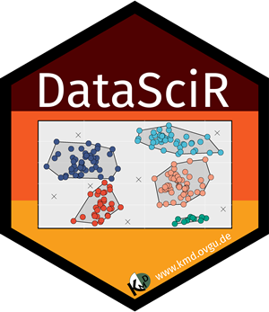

```{r setup, include=FALSE}
knitr::opts_chunk$set(echo = TRUE)
```

# Project Title: COVID-19 Prediction using CT-Scans

## Team:

#### Jalaj, Vora
M.Sc. Digital Engineering <br>

#### Shivam, Singh
M.Sc. Digital Engineering <br>

#### Subhankar, Patra
M.Sc. Data and Knowledge Engineering <br>

#### Subhajit, Mondal
M.Sc. Data and Knowledge Engineering <br>

#### Roshmitha, Thummala
M.Sc. Data and Knowledge Engineering <br>

***

## Background and Motivation:

***

## Ground Truth:

***

## Data Science Pipeline Design Overview

***

## Time Plan

**2 Meetings per week. Tuesday and Friday at 17:30 Sharp!**

```{r echo = FALSE, results='asis'}

d<-data.frame(Sr.nr.= c(1,2,3),
              x=c(11,12,23), 
              y=c(54,54,54),
              z=c(1,2,3),
              w=c(1,2,3),
              r=c(1,2,3))
library(knitr)

kable(d, row.names = NA, col.names = NA,  align = "lll", caption = "A Sample Table")
```

***

