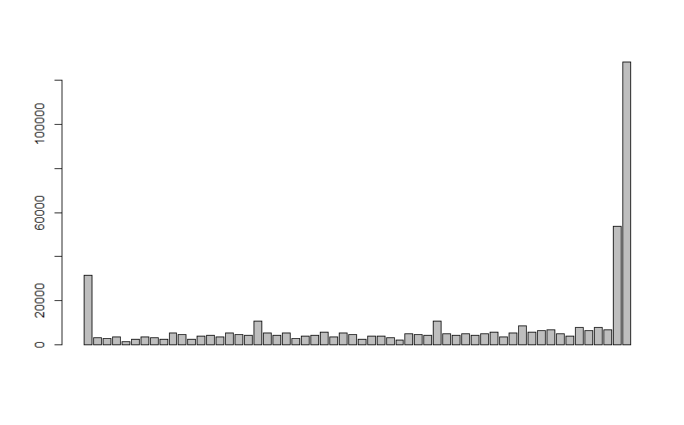
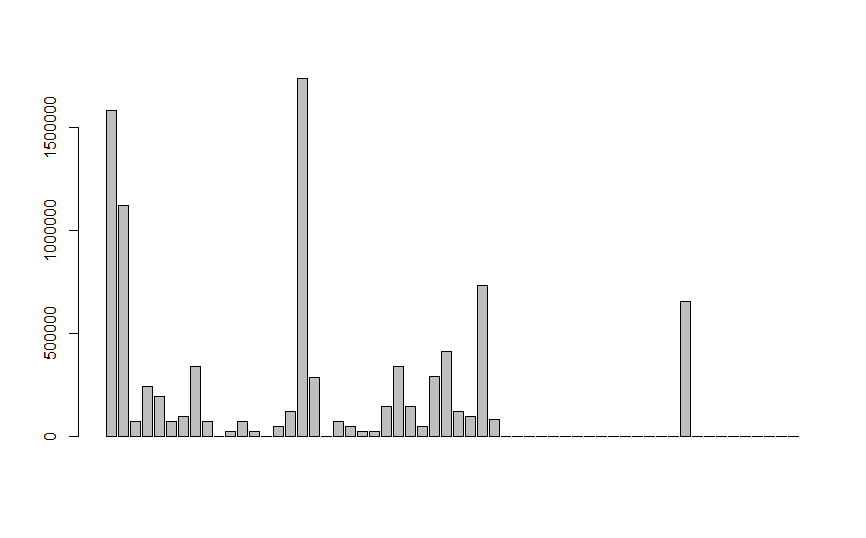

---
header-includes:
   - \usepackage{bbm}
always_allow_html: yes

title: "Exploratory Data Analysis"

bookdown::html_document2: default
output:
  html_document:
    df_print: paged
    toc: true
    toc_depth: 4
    toc_float: 
      collapsed: true
      smooth_scroll: true
    theme: yeti
    highlight: default
link-citations: yes
bibliography: references.bib
csl: data-and-knowledge-engineering.csl
---

&nbsp;
&nbsp;
&nbsp;

# Data Imbalance

Real world datasets are mostly imbalanced. The COVID-19 CXR (Chest X-Rays) dataset we used has around 1000 to 313 negative to positive ratio. That there are nearly three times more negative cases than that of positive. The classification algorithms in this case tends to favor the majority class. The distribution of the classes in the dataset in reality refers to the actual class distribution of the covid affected cases. Hence, the learning task in hand is a imbalanced learning task because there are more people with healthy lungs than that of with COVID-19.


There are several methods to deal with this problem in classification setting, where the main objective is to rebalance the distribution by resampling the data to reduce the class imbalance problem, namely oversampling and under sampling. For our purpose we have used k fold cross-validation to train our model, where the data is split into multiple portions, and then (k-1) splits are used for training and 1 split for validation. And then this process is repeated several times.


# Feature Extraction

For CXR images, the visual attribute that shows the most promising results are the texture based descriptors. There are several texture based descriptors that are available, both handcrafted and non handcrafted, however, we have focused mostly on the widely used Local Binary Patterns, formularized by [@ojala1996comparative].


LBP is a powerful texture descriptor, that has been applied on several classification tasks involving the texture. The LBP is calculated on a pixel to pixel basis by considering a center pixel(c) and its neighbourhood pixels (n) with some radius. Each neighbour pixel n is compared with center pixel c by means of substracting the grey values say g(c) and g(n)  to get a distance d, such that if the d is negative then 0 is substituted in the place of the neighbour pixel else 1.

$$d = 1~~iff~~g(c)-g(n)≥0$$
$$d=0~otherwise$$

The descriptor is then the histogram of such which counts the occurrence of binary pattens. The histogram depends on the setup of the radius and the obviously the pixel neighborhood. LBP has been successfully tried on several classification techniques [@paula2014forest]

**Parameters:** Parameters used for the purpose are LBP ~8,2~ with 58 dimensions. The details of the parameters can be found in [@ojala1996comparative].

**Vectors:** As is previously explained there are total of 58 dimensions, to the descriptor. For a given CXR image we initially ran the descriptor on the complete image, and thus the descriptors obtained were very rich.

For the given image:

<center>
  
</center>

However, with this setting there is a problem, that the CXR image not only captures the area of the lungs but the whole rib cage, which includes other organs too. Hence there is much noise considering out aim of getting the features our of the are of the lungs. For that purpose we used segmentation (details in segmentation area), to segment the area of the lungs our by means of a mask and then calculate the LBP for the masked area.

<center>
   
</center>

As expected in this case, some of the bins of the histogram are empty due to the usage of masking of the image.

# Model {.tabset}

## kNN

K-Neigherst Neighbour is one of the models used for classification. kNN has been successfully used in tasks where texture-based descriptors are used [@sorensen2008texture]. In kNN classification, we expect that the classifier will examine the k nearest neighbors and return the class labels associated with the majority of k nearest neighbor. The accuracy of the model depends heavily on k, i.e. the number of nearest neighbors to consider for classification purpose. So, each neighbor adds a vote or a confidence towards the classification of a query instance. We use this model, in hope that the features extracted above captures the specific discriminatory properties of the lung area and on similar note the nearest neighbors will capture the same properties. 

### Parameters and Settings 

We initially split the data by a proportion of 30:70 distributed among both the classes for test and training purpose.
You can also embed plots, for example:

```{r libraries, results='hide', warning = FALSE, message=FALSE}

library(caret)
library(ggplot2)
library(wvtool)
library(imager)
library(ROSE)
```

```{r wd, echo=FALSE}
load("covid_data_new_masked")
glass.df = covid_data
```


```{r pre-process, echo=TRUE}
# all the independent variables are numbers
# we will convert the type variable which is the response variable as factor
glass.df$V59<- as.factor(glass.df$V59) # 7 labels

# training and test data 70:30
set.seed(123)
ind = sample(2, nrow(glass.df), replace = TRUE, prob=c(0.7,0.3))
train.df = glass.df[ind == 1,]
test.df = glass.df[ind == 2,]
```


For training, to tackle the class imbalance problem and we use 10 cross validation with 3 repeats. That is data will be split entirely 3 times, and for each of the 3 times, 10-fold cross validation is done for validation.

``` {r echo=TRUE}
trctrl <- trainControl(method = "repeatedcv", number = 10, repeats = 3)
```

For evaluation of K, we decide at train time, the number that gives the highest accuracy. In our case, k=9 gave us the best accuracy.
``` {r results='hide', warning = FALSE, message=FALSE}

knn_fit <- train(V59 ~., data = train.df, method = "knn",
                 trControl=trctrl,
                 preProcess = c("center", "scale"),
                 tuneLength = 15)

```


```{r}

summary(knn_fit)
plot(knn_fit)

```
The pipeline of KNN model we use, additionally centers and scales the data. The unseen instances are also subject to the same fit.


We also use a setting where the response is not a discrete  positive or negative output but, gives the prediction confidence(probability) of the classifier for both of the classes.


**Results:** We test the model with the test data that was initially split out from the overall dataset

``` {r prediction, echo = TRUE}
test_pred <- predict(knn_fit, newdata = test.df)
summary(test_pred)
confusionMatrix(test_pred, test.df$V59)
roc.curve(test.df$V59, test_pred, plotit = T)
```
## SVM with Rbf kernel

(tab content)

## Logitistic Regression

(tab content)

## Random Forest

(tab content)

### Decision Trees

(tab content)

## Naive Bayes

(tab content)


# References