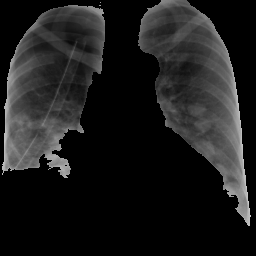

---
header-includes:
   - \usepackage{bbm}
always_allow_html: yes
title: "Results"

bookdown::html_document2: default
output:
  html_document:
    df_print: paged
    toc: true
    toc_depth: 4
    toc_float: 
      collapsed: true
      smooth_scroll: true
    theme: yeti
    highlight: default

link-citations: yes
bibliography: references.bib
csl: data-and-knowledge-engineering.csl
---

&nbsp;
&nbsp;
&nbsp;
```{r setup, include=FALSE}
knitr::opts_chunk$set(echo = TRUE)
```

#Models {.tabset}

## SVM

We used Support Vector Classifiers with Radial Basis function as kernel. With the hyper-parameter tuning, we found value of cost = 1 and gamma = 0.5 to be optimal w.r.t our ground truth.


### Library Imports

The CRAN packages `e1071` for classification using Support Vector Classifiers with Radial Basis Function kernel and hyper-parameter tuning and `ROSE` for over-sampling of data are being used.
```{r library, echo=TRUE}
library(e1071)
library(ROSE)
```


### Pre-Processing
```{r preprocessing, echo=FALSE}

load('covid_data_new_masked')
dataset <- covid_data
summary(dataset)


#Factoring the Target variable of (0,1)
dataset$V59 = factor(dataset$V59, levels = c(0, 1))
print(is.factor(dataset$V59))

#Dataset Split
index <- 1:nrow(dataset)
testindex <- sample(index, trunc(length(index)/3))
testset <- dataset[testindex,]
trainset <- dataset[-testindex,]


#Over-Sampling
train_ov_sampled <- ovun.sample(V59 ~ ., trainset, method = "over")$data
table(train_ov_sampled$V59)

test_ov_sampled <- ovun.sample(V59 ~ ., testset, method = "over")$data
table(test_ov_sampled$V59)

```

### Classification
``` {r classification, echo=TRUE}
set.seed(825)

#fitting the Support Vector Machine to the Training set
svm_fit_ovs <- svm(V59~., kernel = 'radial',
               data = train_ov_sampled, scale=TRUE, cachesize = 200,
               probability = TRUE, gamma = 0.5, cost = 1)

summary(svm_fit_ovs)


#Hyper-Parameter Tuning
# obj <- tune.svm(V59~., data = train_ov_sampled, sampling = "cross",
#           gamma = 2^c(-1:4), cost = c(1:10))
# summary(obj)
```

### Prediction
```{r prediction, echo=FALSE}
#Predicting the test set results
svm.pred.ovs <- predict(svm_fit_ovs, test_ov_sampled[,-59], probability = TRUE)


plot(svm.pred.ovs)

summary(svm.pred.ovs)
```


### Evaluation
```{r evaluation, echo=FALSE}
#Evaluation on Test_Set
accuracy.meas(response = test_ov_sampled$V59, predicted = svm.pred.ovs)

roc.curve(test_ov_sampled$V59, svm.pred.ovs, plotit = T)

caret::confusionMatrix(svm.pred.ovs, test_ov_sampled$V59, positive = '1')
```


# Explanations

Apart from prediction of positive and negative for Covid-19 cases from CXR images, we try providing an explanation of which areas of the image contributes towards the predicted results. Local interpretable model-agnostic explanations (LIME) [@ribeiro2016should] is a local surrogate model. That is instead of explaining the global prediction, it only explains the local prediction. Therefore once the predictions are available, the LIME model can be run, in hope that, the model finds the areas of the image that contributes most towards the prediction.


Given any(black box/transparent) model, the Lime model probes the model and gets the output any number of time(theoritically). Lime creates a data set consist of permutated samples of the images, and feed those images to the model and tries to predict what happens to the predictions for the permutated samples.


We initially ran our application, while feeding the whole image. However, as expected the areas where the lime model is trying to explain, is outside the intended region. For that reason, we give the model, the masked lungs image as input, while the other parts of the image is black. We thus, force the lime model to do any changes in the model on the intended area. This time, as expected the lime model focuses more on the parts of the lungs and thus gives a better performance.

<center>

   

</center>


**Parameters and settings:**
As a part of preprocessing of the images to be fed to the lime model, we do greyscaling of the image. While no resizing is done, the image is processed so that the 1 channel greyscaled masked image is fed to the LIME model. 

Number of features to find is set to 10. 

Only “positive” areas are marked in the explanation image.