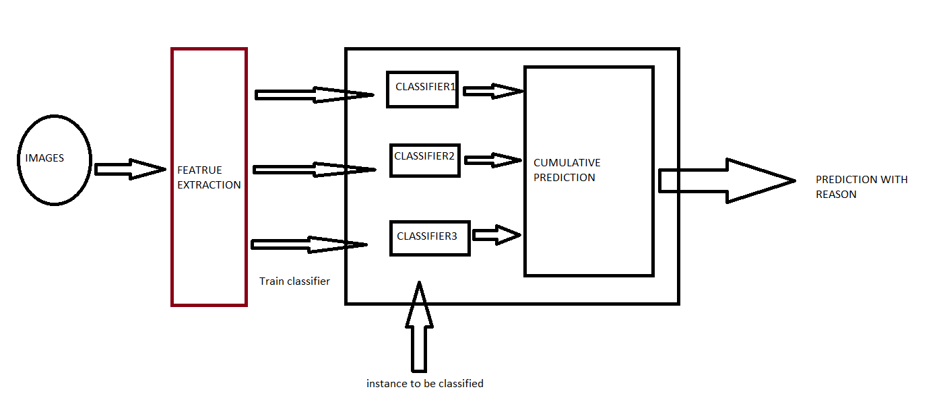

&nbsp;
&nbsp;
&nbsp;

```{r setup, include=FALSE}
knitr::opts_chunk$set(echo = TRUE)
```


## Background and Motivation

The COVID-19 or the SARS-CoV-2 originated from the district of Wuhan, China has transpired to be a pandemic worldwide [@WHO]. Research on the COVID-19 is a hot topic among the Artificial Intelligence community recently. Due to shortage and limited efficiency of current testing mechanism of COVID-19 tests, i.e. through RT-PCR kits [@Zhao2020COVIDCTDatasetAC]; which usually takes upto 4-6 hours to reproduce the results is not very optimal way to move forward as the rate of COVID-19 patients registered grows exponentially. With this problem in scientific community, it motivated the aim of Machine Learning methods be brought to be a part in helping flattening the curve [@Respond]. So, this lead to a goal of building classifiers which can diagonise patients as COVID-19 negative or positive based on their respective X-Ray images [@wang2020covid; @narin2020automatic]. As this approach is less time and resource consuming; it is expected to achieve more streamlined performance compared to RT-PCR kits. Also in addition to a good prediction, we needed reasons that could justify what could be the features that are responsible in the diagonistic process [@karim2020deepcovidexplainer]. 

With this idea and motivation in hand, our work tries to experiment in building classifiers with CXR (Chest X-Rays) as Ground Truth that predicts whether an X-Ray image is COVID-19 negative or positive. Along with, we try to come up with features that contributes to the detection of an image and also with an explaination delineating why was such a behaviour observed.


***
## Project Objective

With the motivation to help fight against and analyse COVID-19, we came up with a research question of whether

> Can we use Machine Learning methods to diagonise COVID-19 and explain the prediction? 

To answer the this question, we aim to answer few sub-questions:

* How well could classifiers perform on Chest X-Rays?
* Although [@Zhao2020COVIDCTDatasetAC] and [@karim2020deepcovidexplainer] extensively works with Neural Networks (Black-Box Model) to classify, Can simple and intrinsically explainable classifiers achieve a base Accuracy, F~1~-Score and AUC of 85% using CXR?
* How does different features of CXR contribute to the model prediction and Can we come up with few number of feature w.r.t their importance?
* Which flavour of algorithm perform best among all and is there a possibility of Classification in Ensemble setting?
* Can we come up with explaination of our model's decsision and prediction?

***
## Dataset

Our Dataset consists of 313 Positive COVID CXR and 1000 Negative CXR collected from four different sources to make our version of the dataset to work upon. This includes COVIDx dataset of @karim2020deepcovidexplainer[^1], Kaggle CXR Pneumonia dataset by Paul Mooney [^2], CXR images of adult subjects from the RSNA Pneumonia Detection Challenge [^3], original and augmented versions of COVID-19 examples [^4] from @cohen2020covid. 

According to [@Zhao2020COVIDCTDatasetAC; @wang2020deep; @li2020artificial; @karim2020deepcovidexplainer; @singh2020classification] CT-Scan data would be gold-standard for us and also potray pretty good results evaluated in terms of Accuracy and F~1~-Score. However, due to CT Scan being available in very less quantity publicly, we would like to use Chest X-rays as our dataset. Though, it won't be that competible in terms of quality w.r.t CT-Scans but @KERMANY20181122 suggests CXR to be sufficient and comparable to CT-Scans in order to diagnose COVID-19 patients.

In particular we have used the [COVID-19 Dataset-Repo](https://shorturl.at/qwLR0) as our Ground Truth.

[^1]: https://github.com/rezacsedu/DeepCOVIDExplainer
[^2]: https://www.kaggle.com/paultimothymooney/chest-xray-pneumonia
[^3]: https://www.kaggle.com/c/rsna-pneumonia-detection-challenge
[^4]: https://github.com/ieee8023/covid-chestxray-dataset

### <span class="sub-header">GitHub URL</span>
The `R` scripts, process notebook and other resources have been stored at the [repository](https://github.com/JalajVora/Data-Science-with-R-Project.git).

***
## Design Overview (Algorithms and Methods)

We followed a typical Data Science pipeline starting with Pre-Processing of the Dataset, Feature Extraction and Selection and then feeding Descriptors (Trainable Vectors) to different classifiers to train and test and then finally evaluation would be done based on predictor's results. The details are delineated in the following sections:

* **Pre-Processing**
  * **Cropping**
    - We are dealing with higly skewed dataset of CXR imgaes.
    - These imgaes are initally cropped and normalised to 256*256 fashion.
  * **Masking**
    - The normalised images are then masked for the lung segment using CNN.
  * **Segmentation**
    - These masked images are then formed in a manner where the masked portion is deducted from the orginal image and the background as been colored black for the ease to processing.
    - These segmented images are just the lung-segment from the original CXR with a black background.
    
* **Feature Extraction**
  * **Local Binary Pattern**
    - There exist several texture-based vision algorithms. We combined features before training and train our model on a combined feature set; Or else we can train models on individual features, and then combine prediction results might be combined and thus one feature might only not be selected but multiple features can be selected [@pereira2020covid]. 
    - As Literature survey suggests, we found Local Binary Patterns [@nanni2010local] as a good choice for texture-based descriptor.
    - Local Binary Patterns inputs pre-processed image and outputs corresponding lbp vector.
    - Local Binary Pattern works only with grayscale images. The dataset contains RGB and RGBa images which are intrinsincally normalised to grayscale before converting it into a vector.
* **Re-sampling**
  - The LPB vectors are then oversampled as the dataset contains highly skewed distribution of target class.
  - Re-sampling techniques tried:
    - Random Under-Sampling
    - Over-Sampling:
      - Random Over-Sampling
      - Density Based-SMOTE [@bunkhumpornpat2012dbsmote]
      - Borderline-SMOTE [@han2005borderline]
      - AdaSyn [@he2008adasyn]


* **Classification**
  - The problem is an imbalance learning for a binary classification for images being COVID-19 positive or negative [@fernandez2013analysing]. 
  - Here, we would like to emphasize that the model won’t predict presence or absence or pneumonia, which is a result not only of COVID-19 but other kind of reasons also affect this.
  - We implemented following algorithms [@albahri2020role]:
    + k-nearest neighbours
    + Logistic Regression
    + Support Vector Machine 
    + Tree-based Classifiers
      - Decision Trees
      - Naive Bayes
  
 <center>  </center>

* **Evaluation**
  - The higher the metric value the better the performance.
    - *Accuracy*
    - *Precision*
    - *Recall*
    - *F~1~-Score*
    - *AUC & ROC*

***

## Screencast

{width="90%"}

***

## Team
1. Subhajit Mondal
2. Jalaj Vora
3. Subhankar Patra
4. Shivam Singh
5. Roshmitha Thummala

***

## R packages
The following packages must be installed in R-Studio:

``` {r packages, echo=TRUE, eval=FALSE}

## The script installs the necessary packages if not already installed, and then loads them

packages <- c(
  "caret",
  "imbalance",
  "e1071",
  "randomForest",
  "imager",
  "wvtool",
  "rpart",
  "ROSE",
  "dplyr",
  "tidyr",
  "ggplot2",
  "rmarkdown",
  "tidyverse",
  "kableExtra",
  "knitr"
  "jsonlite"
  "crul"
  "rpart.plot"
  "pROC"
  "plotROC"
  "magick"
  "funModeling"
  "DataExplorer"
  "tidyverse"
  "repr"
  "factoextra"
  "pander"
  "klaR"
  "janitor"
  "mlbench"
  "MLmetrics"
)

verify.packages <- function(pkg) {
  new.pkg <- pkg[!(pkg %in% installed.packages()[, "Package"])]
  if (length(new.pkg))
    install.packages(new.pkg, dependencies = TRUE)
  sapply(pkg, library, character.only = TRUE)
}

verify.packages(packages)

```

***

## References