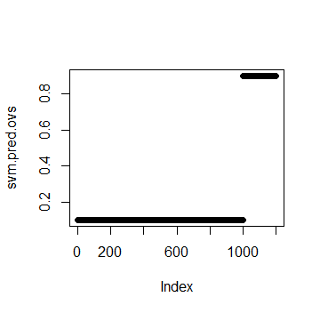

```{r setup, include=FALSE}
knitr::opts_chunk$set(echo = TRUE)
setwd("C:\\Users\\jalaj\\Documents\\GitHub\\Data-Science-with-R-Project\\covid-dataset")
load('covid_data_new_masked')
dataset <- covid_data
```


## Background and Motivation:

The COVID-19 or the SARS-CoV-2 originated from the district of Wuhan, China has transpired to be a pandemic worldwide [@WHO]. Research on the COVID-19 is a hot topic among the Artificial Intelligence community recently. Due to shortage and limited efficiency of current testing mechanism of COVID-19 tests, i.e. through RT-PCR kits [@Zhao2020COVIDCTDatasetAC]; which usually takes upto 4-6 hours to reproduce the results is not very optimal way to move forward as the rate of COVID-19 patients registered grows exponentially. With this problem in scientific community, it motivated the aim of Machine Learning methods be brought to be a part in helping flattening the curve [@Respond]. So, this lead to a goal of building classifiers which can diagonise patients as COVID-19 negative or positive based on their respective X-Ray images [@wang2020covid; @narin2020automatic]. As this approach is less time and resource consuming; it is expected to achieve more streamlined performance compared to RT-PCR kits. Also in addition to a good prediction, we needed reasons that could justify what could be the features that are responsible in the diagonistic process [@karim2020deepcovidexplainer]. 

With this idea and motivation in hand, our work tries to experiment in building classifiers with CXR (Chest X-Rays) as Ground Truth that predicts whether an X-Ray image is COVID-19 negative or positive. Along with, we try to come up with features that contributes to the detection of an image and also with an explaination delineating why was such a behaviour observed.


***
## Project Objective:

With the motivation to help fight against and analyse COVID-19, we came up with a research question of whether

> Can we use Machine Learning methods to diagonise COVID-19 and explain the prediction? 

To answer the this question, we aim to answer few sub-questions:

* How well could classifiers perform on Chest X-Rays?
* Although [@Zhao2020COVIDCTDatasetAC] and [@karim2020deepcovidexplainer] extensively works with Neural Networks (Black-Box Model) to classify, Can simple and intrinsically explainable classifiers achieve a base Accuracy, F~1~-Score and AUC of 85% using CXR?
* How does different features of CXR contribute to the model prediction and Can we come up with few number of feature w.r.t their importance?
* Which flavour of algorithm perform best among all and is there a possibility of Classification in Ensemble setting?
* Can we come up with explaination of our model's decsision and prediction?

***

## Related Work:

(content)

***
## Dataset:

Our Dataset consists of 313 Positive COVID CXR and 1000 Negative CXR collected from four different sources to make our version of the dataset to work upon. This includes COVIDx dataset of @karim2020deepcovidexplainer[^1], Kaggle CXR Pneumonia dataset by Paul Mooney [^2], CXR images of adult subjects from the RSNA Pneumonia Detection Challenge [^3], original and augmented versions of COVID-19 examples [^4] from @cohen2020covid. 

According to [@Zhao2020COVIDCTDatasetAC; @wang2020deep; @li2020artificial; @karim2020deepcovidexplainer; @singh2020classification] CT-Scan data would be gold-standard for us and also potray pretty good results evaluated in terms of Accuracy and F~1~-Score. However, due to CT Scan being available in very less quantity publicly, we would like to use Chest X-rays as our dataset. Though, it won't be that competible in terms of quality w.r.t CT-Scans but @KERMANY20181122 suggests CXR to be sufficient and comparable to CT-Scans in order to diagnose COVID-19 patients.

In particular we have used the [COVID-19 Dataset-Repo](https://shorturl.at/qwLR0) as our Ground Truth.

[^1]: https://github.com/rezacsedu/DeepCOVIDExplainer
[^2]: https://www.kaggle.com/paultimothymooney/chest-xray-pneumonia
[^3]: https://www.kaggle.com/c/rsna-pneumonia-detection-challenge
[^4]: https://github.com/ieee8023/covid-chestxray-dataset

***

## Exploratory Data Analysis:

### <span class="sub-header">Data</span>

The dataset consists of 1313 Chest X-rays images. These images are grayscale images

***

### <span class="sub-header">Data Exploration</span>
The original dataset used for the experiment contains total of 1313 CXR images. These are 1000 COVID-19 negative and 313 COVID-19 positive CXR images. This shows a high skew towards positives in the dataset just for the reason of less availability of negatives in comparision to positives.

``` {r dataset, echo=FALSE, warning=FALSE, message=FALSE, fig.align = 'center'}
library(magick)

covid.neg <- image_read('C:/Users/jalaj/Documents/DataSci with R/Project Files/covid-dataset/covid-negative/1.jpg')

print(covid.neg)
```

The figure above shows an instance of a COVID-19 negative images. Similar to this image, all the images in the dataset are in Standard RGB color space. The dataset contains files in `.jpg`, `.jpeg` and `.png` formats. All the files are standardised to `.png` format for the ease of further processing.

<center>  </center>
```{r distribution_plot}
library(ggplot2)
qplot(covid_data$V59, binwidth=0.1, main = 'Data Distribution Histogram', xlab = 'Target Variable', ylab = 'Number of Samples')
```

The figure above shows the skewness of the distribution of the data. The plot states the frequency of the positive and negative images in the dataset. Here, for the interpretation; 0 is taken as COVID negative and 1 as COVID positive. The figure delineates the ratio of images as being approx. 3:1. This signifies the data being skewed towards the positive instances.

``` {r data-frequency}

library(funModeling)
freq(covid_data$V59)

```

***

## Final Analysis:

***

### <span class="sub-header">Conclusion:</span>

***

## References