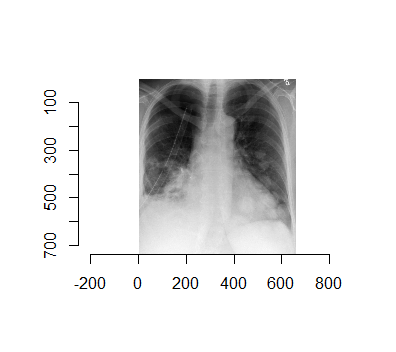
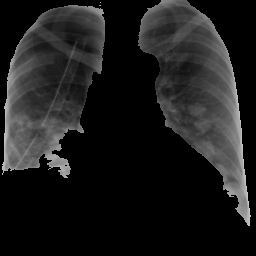
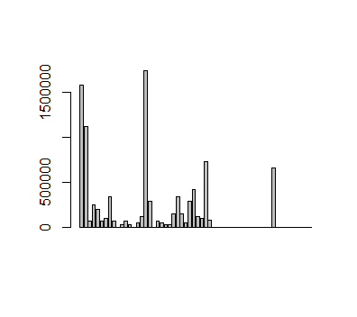

```{r setup, echo=FALSE}
#setwd("C:\\Users\\jalaj\\Documents\\GitHub\\Data-Science-with-R-Project\\covid-dataset")
load('covid_data_new_masked')
dataset <- covid_data
```


## Background and Motivation:

The COVID-19 or the SARS-CoV-2 originated from the district of Wuhan, China has transpired to be a pandemic worldwide [@WHO]. Research on the COVID-19 is a hot topic among the Artificial Intelligence community recently. Due to shortage and limited efficiency of current testing mechanism of COVID-19 tests, i.e. through RT-PCR kits [@Zhao2020COVIDCTDatasetAC]; which usually takes upto 4-6 hours to reproduce the results is not very optimal way to move forward as the rate of COVID-19 patients registered grows exponentially. With this problem in scientific community, it motivated the aim of Machine Learning methods be brought to be a part in helping flattening the curve [@Respond]. So, this lead to a goal of building classifiers which can diagonise patients as COVID-19 negative or positive based on their respective X-Ray images [@wang2020covid; @narin2020automatic]. As this approach is less time and resource consuming; it is expected to achieve more streamlined performance compared to RT-PCR kits. Also in addition to a good prediction, we needed reasons that could justify what could be the features that are responsible in the diagonistic process [@karim2020deepcovidexplainer]. 

With this idea and motivation in hand, our work tries to experiment in building classifiers with CXR (Chest X-Rays) as Ground Truth that predicts whether an X-Ray image is COVID-19 negative or positive. Along with, we try to come up with features that contributes to the detection of an image and also with an explaination delineating why was such a behaviour observed.


***
## Project Objective:

With the motivation to help fight against and analyse COVID-19, we came up with a research question of whether

> Can we use Machine Learning methods to diagonise COVID-19 and explain the prediction? 

To answer the this question, we aim to answer few sub-questions:

* How well could classifiers perform on Chest X-Rays?
* Although [@Zhao2020COVIDCTDatasetAC] and [@karim2020deepcovidexplainer] extensively works with Neural Networks (Black-Box Model) to classify, Can simple and intrinsically explainable classifiers achieve a base Accuracy, F~1~-Score and AUC of 85% using CXR?
* How does different features of CXR contribute to the model prediction and Can we come up with few number of feature w.r.t their importance?
* Which flavour of algorithm perform best among all and is there a possibility of Classification in Ensemble setting?
* Can we come up with explaination of our model's decsision and prediction?


***
## Dataset:

Our Dataset consists of 313 Positive COVID CXR and 1000 Negative CXR collected from four different sources to make our version of the dataset to work upon. This includes COVIDx dataset of @karim2020deepcovidexplainer[^1], Kaggle CXR Pneumonia dataset by Paul Mooney [^2], CXR images of adult subjects from the RSNA Pneumonia Detection Challenge [^3], original and augmented versions of COVID-19 examples [^4] from @cohen2020covid. 

According to [@Zhao2020COVIDCTDatasetAC; @wang2020deep; @li2020artificial; @karim2020deepcovidexplainer; @singh2020classification] CT-Scan data would be gold-standard for us and also potray pretty good results evaluated in terms of Accuracy and F~1~-Score. However, due to CT Scan being available in very less quantity publicly, we would like to use Chest X-rays as our dataset. Though, it won't be that competible in terms of quality w.r.t CT-Scans but @KERMANY20181122 suggests CXR to be sufficient and comparable to CT-Scans in order to diagnose COVID-19 patients.

In particular we have used the [COVID-19 Dataset-Repo](https://shorturl.at/qwLR0) as our Ground Truth.

[^1]: https://github.com/rezacsedu/DeepCOVIDExplainer
[^2]: https://www.kaggle.com/paultimothymooney/chest-xray-pneumonia
[^3]: https://www.kaggle.com/c/rsna-pneumonia-detection-challenge
[^4]: https://github.com/ieee8023/covid-chestxray-dataset

***

## Exploratory Data Analysis:

### <span class="sub-header">Data Exploration</span>
The original dataset used for the experiment contains total of 1313 CXR images. The image below is an instance of COVID negative image. The figure above shows an instance of a COVID-19 negative images. Similar to this image, all the images in the dataset are in Standard RGB color space. The dataset contains files in `.jpg`, `.jpeg` and `.png` formats. All the files are standardised to `.png` format for the ease of further processing.
``` {r cropped, echo=FALSE, warning=FALSE, message=FALSE, fig.align = 'center'}
library(magick)
covid.neg <- image_read('C:/Users/jalaj/Documents/DataSci with R/Project Files/covid-dataset/covid-negative/1.jpg')
print(covid.neg)
```


These are 1000 COVID-19 negative and 313 COVID-19 positive CXR images. This shows a high skew towards positives in the dataset just for the reason of less availability of negatives in comparision to positives. 
```{r distribution_plot, echo=FALSE, message=FALSE, warning=FALSE, fig.align = 'center'}
library(ggplot2)
qplot(covid_data$V59, binwidth=0.1, main = 'Data Distribution Histogram', xlab = 'Target Variable', ylab = 'Number of Samples')
```


The figure above shows the skewness of the distribution of the data. The plot states the frequency of the positive and negative images in the dataset. Here, for the interpretation; 0 is taken as COVID negative and 1 as COVID positive. The figure delineates the ratio of images as being approx. 3:1. This signifies the data being skewed towards the positive instances.


``` {r data-frequency, echo=FALSE, message=FALSE, warning=FALSE, fig.align = 'center'}
library(funModeling)
freq(covid_data$V59)
```

Pie chart is the simplest representation of the dataset. This shows amount of images in percentage.
``` {r pie-chart, echo=FALSE, message=FALSE, warning=FALSE, fig.align = 'center'}

mytable <- table(covid_data$V59)
lbls <- c("0", "1")
piepercent<- round(100*mytable/sum(mytable), 1)
pie(mytable, labels =  piepercent, col=rainbow(length(lbls)), main = "Percentage of positives and negatives")
```


### <span class="sub-header">Data Pre-processing</span>

The raw images are fed into the Local Binary Pattern Algorithm. The Algorithm takes the images and resizes into 256*256 height to width format.

```{r resizing, echo=FALSE, message=FALSE, warning=FALSE, fig.align = 'center'}
scaled <- image_scale(covid.neg, "256x256")
print(scaled)
```

### <span class="sub-header">Feature Extraction</span>
For CXR images, the visual attribute that shows the most promising results are the texture based descriptors. There are several texture based descriptors that are available, both handcrafted and non handcrafted, however, we have focused mostly on the widely used Local Binary Patterns, formularized by [@ojala1996comparative].


LBP is a powerful texture descriptor, that has been applied on several classification tasks involving the texture. The LBP is calculated on a pixel to pixel basis by considering a center pixel(c) and its neighbourhood pixels (n) with some radius. Each neighbour pixel n is compared with center pixel c by means of substracting the grey values say g(c) and g(n)  to get a distance d, such that if the d is negative then 0 is substituted in the place of the neighbour pixel else 1.

$$d = 1~~iff~~g(c)-g(n)≥0$$
$$d=0~otherwise$$

The descriptor is then the histogram of such which counts the occurrence of binary pattens. The histogram depends on the setup of the radius and the obviously the pixel neighborhood. LBP has been successfully tried on several classification techniques [@paula2014forest]

**Parameters:** Parameters used for the purpose are LBP ~8,2~ with 58 dimensions. The details of the parameters can be found in [@ojala1996comparative].

**Vectors:** As is previously explained there are total of 58 dimensions, to the descriptor. For a given CXR image we initially ran the descriptor on the complete image, and thus the descriptors obtained were very rich.

However, with this setting there is a problem, that the CXR image not only captures the area of the lungs but the whole rib cage, which includes other organs too. Hence there is much noise considering out aim of getting the features our of the are of the lungs. For that purpose we used [segmentations](https://lmb.informatik.uni-freiburg.de/people/ronneber/u-net/) [@10.1007/978-3-319-24574-4_28], to segment the area of the lungs our by means of a mask and then calculate the LBP for the masked area.
<center>
   
</center>

As expected in this case, the figure below shows some of the bins of the histogram are empty due to the usage of masking of the image.

<center></center>

All the images are converted into grayscale because the Local Binary Pattern works only with grayscale images.

```
img <- grayscale(img)
```

The Algorithm converts the images into a data matrix and feds it into local binary function which creates the lbp vectors for the corresponding image.

```
imgm <- data.matrix(img)
lbpd <- lbp(imgm, 2)
```

Thereafter, it forms a dataframe of 1313 rows and 59 columns where 59th column being the Target Class with values `0` for COVID negatives and `1` for COVID positives.
```{r data-explorer, echo=FALSE, warning=FALSE, message=FALSE, fig.align = 'center'}
library(DataExplorer)
#DataExplorer::create_report(data)
introduce(dataset)
plot_intro(dataset)
```


The figure below shows the structure of the data frame.
```{r fram-struct, echo=FALSE, warning=FALSE, message=FALSE, fig.align = 'center'}
plot_str(dataset)
```

Since the real world data can be messy, the following plot below shows the missing values in columns. All the columns are kept nameless and are therefore by default named **"V#"** with its repective column number.

```{r plot, echo=FALSE, warning=FALSE, message=FALSE, fig.align = 'center'}
plot_missing(dataset)
```


The figures below shows column-wise vector representation:
``` {r bar, echo=FALSE, warning=FALSE, message=FALSE, fig.align = 'center'}
plot_bar(dataset$V59)

```

The following plot shows visualisation of distribution of lbp vector column-wise:
```{r hist, echo=FALSE, warning=FALSE, message=FALSE, fig.align = 'center'}
plot_histogram(dataset)
```


The figure below shows that very few columns vectors appears to be correlated. This is the case because the data has been masked.
``` {r bar1, echo=FALSE, warning=FALSE, message=FALSE, fig.align = 'center'}
plot_correlation(na.omit(dataset))
```

The figure shows Quantile-Quantile plot showing distribution of all the columns compared to normal distribution.
``` {r qq-plot, echo=FALSE, warning=FALSE, message=FALSE, fig.align = 'center'}
plot_qq(dataset, sampled_rows = 1000L)
```


The following shows the variance in percentage for all the lbp vectors by **Principal Component Analysis**.
``` {r scatter, echo=FALSE, warning=FALSE, message=FALSE, fig.align = 'center'}
pca_df <- na.omit(dataset)
plot_prcomp(pca_df, variance_cap = 0.9, nrow = 2L, ncol = 2L)
```


***

## Final Analysis: {.tabset}

### SVM {.tabset}

We used Support Vector Classifiers with Radial Basis function as kernel. With the hyper-parameter tuning, we found value of cost = 1 and gamma = 0.5 to be optimal w.r.t our ground truth.


#### Library Imports

The CRAN packages `e1071` for classification using Support Vector Classifiers with Radial Basis Function kernel and hyper-parameter tuning and `ROSE` for over-sampling of data are being used.
```{r library, echo=TRUE}
library(e1071)
library(ROSE)
```


#### Pre-Processing
```{r preprocessing, echo=FALSE}

load('covid_data_new_masked')
dataset <- covid_data
summary(dataset)


#Factoring the Target variable of (0,1)
dataset$V59 = factor(dataset$V59, levels = c(0, 1))
print(is.factor(dataset$V59))

#Dataset Split
index <- 1:nrow(dataset)
testindex <- sample(index, trunc(length(index)/3))
testset <- dataset[testindex,]
trainset <- dataset[-testindex,]


#Over-Sampling
train_ov_sampled <- ovun.sample(V59 ~ ., trainset, method = "over")$data
table(train_ov_sampled$V59)

test_ov_sampled <- ovun.sample(V59 ~ ., testset, method = "over")$data
table(test_ov_sampled$V59)

```

#### Classification
``` {r classification, echo=TRUE}
set.seed(825)

#fitting the Support Vector Machine to the Training set
svm_fit_ovs <- svm(V59~., kernel = 'radial',
               data = train_ov_sampled, scale=TRUE, cachesize = 200,
               probability = TRUE, gamma = 0.5, cost = 1)

summary(svm_fit_ovs)


#Hyper-Parameter Tuning
# obj <- tune.svm(V59~., data = train_ov_sampled, sampling = "cross",
#           gamma = 2^c(-1:4), cost = c(1:10))
# summary(obj)
```

#### Prediction
```{r prediction, echo=FALSE}
#Predicting the test set results
svm.pred.ovs <- predict(svm_fit_ovs, test_ov_sampled[,-59], probability = TRUE)


plot(svm.pred.ovs)

summary(svm.pred.ovs)
```


#### Evaluation
```{r evaluation, echo=FALSE}
#Evaluation on Test_Set
accuracy.meas(response = test_ov_sampled$V59, predicted = svm.pred.ovs)

roc.curve(test_ov_sampled$V59, svm.pred.ovs, plotit = T)

caret::confusionMatrix(svm.pred.ovs, test_ov_sampled$V59, positive = '1')
```

***

#### <span class="sub-header">Conclusion:</span>
<center> 

 


</center>
***

### Random Forest

***

### kNN

***

### Naive Bayes

***

### Multi-layer Perceptron

***

## References