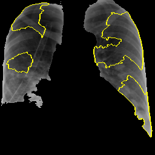

```{r setup, echo=FALSE}
#setwd("C:\\Users\\jalaj\\Documents\\GitHub\\Data-Science-with-R-Project\\covid-dataset")
load('covid_data_new_masked')
dataset <- covid_data
```

```{r packages, echo = FALSE, warning = FALSE, message = FALSE, results='hide'}
library(magick)
library(ggplot2)
library(funModeling)
library(DataExplorer)
library(e1071)
library(imbalance)
library(caret)
library(wvtool)
library(imager)
library(ROSE)
library(tidyverse)       
library(repr)
library(factoextra)
library(pander)
library(klaR)
library(janitor)
library(mlbench)
library(MLmetrics)
library(randomForest)
library(rpart)
library(rpart.plot)
library(pROC)
library(plotROC)
```
## Background and Motivation

The COVID-19 or the SARS-CoV-2 originated from the district of Wuhan, China has transpired to be a pandemic worldwide [@WHO]. Research on the COVID-19 is a hot topic among the Artificial Intelligence community recently. Due to shortage and limited efficiency of current testing mechanism of COVID-19 tests, i.e. through RT-PCR kits [@Zhao2020COVIDCTDatasetAC]; which usually takes upto 4-6 hours to reproduce the results is not very optimal way to move forward as the rate of COVID-19 patients registered grows exponentially. With this problem in scientific community, it motivated the aim of Machine Learning methods be brought to be a part in helping flattening the curve [@Respond]. So, this lead to a goal of building classifiers which can diagonise patients as COVID-19 negative or positive based on their respective X-Ray images [@wang2020covid; @narin2020automatic]. As this approach is less time and resource consuming; it is expected to achieve more streamlined performance compared to RT-PCR kits. Also in addition to a good prediction, we needed reasons that could justify what could be the features that are responsible in the diagonistic process [@karim2020deepcovidexplainer]. 

With this idea and motivation in hand, our work tries to experiment in building classifiers with CXR (Chest X-Rays) as Ground Truth that predicts whether an X-Ray image is COVID-19 negative or positive. Along with, we try to come up with features that contributes to the detection of an image and also with an explaination delineating why was such a behaviour observed.


***
## Project Objective

With the motivation to help fight against and analyse COVID-19, we came up with a research question of whether

> Can we use Machine Learning methods to diagonise COVID-19 and explain the prediction? 

To answer the this question, we aim to answer few sub-questions:

* How well could classifiers perform on Chest X-Rays?
* Although [@Zhao2020COVIDCTDatasetAC] and [@karim2020deepcovidexplainer] extensively works with Neural Networks (Black-Box Model) to classify, Can simple and intrinsically explainable classifiers achieve a base Accuracy, F~1~-Score and AUC of 85% using CXR?
* How does different features of CXR contribute to the model prediction and Can we come up with few number of feature w.r.t their importance?
* Which flavour of algorithm perform best among all and is there a possibility of Classification in Ensemble setting?
* Can we come up with explaination of our model's decsision and prediction?


***
## Dataset

Our Dataset consists of 313 Positive COVID CXR and 1000 Negative CXR collected from four different sources to make our version of the dataset to work upon. This includes COVIDx dataset of @karim2020deepcovidexplainer[^1], Kaggle CXR Pneumonia dataset by Paul Mooney [^2], CXR images of adult subjects from the RSNA Pneumonia Detection Challenge [^3], original and augmented versions of COVID-19 examples [^4] from @cohen2020covid. 

According to [@Zhao2020COVIDCTDatasetAC; @wang2020deep; @li2020artificial; @karim2020deepcovidexplainer; @singh2020classification] CT-Scan data would be gold-standard for us and also potray pretty good results evaluated in terms of Accuracy and F~1~-Score. However, due to CT Scan being available in very less quantity publicly, we would like to use Chest X-rays as our dataset. Though, it won't be that competible in terms of quality w.r.t CT-Scans but @KERMANY20181122 suggests CXR to be sufficient and comparable to CT-Scans in order to diagnose COVID-19 patients.

In particular we have used the [COVID-19 Dataset-Repo](https://shorturl.at/qwLR0) as our Ground Truth.

[^1]: https://github.com/rezacsedu/DeepCOVIDExplainer
[^2]: https://www.kaggle.com/paultimothymooney/chest-xray-pneumonia
[^3]: https://www.kaggle.com/c/rsna-pneumonia-detection-challenge
[^4]: https://github.com/ieee8023/covid-chestxray-dataset

***

## Exploratory Data Analysis

### <span class="sub-header">Data Exploration</span>

Our Dataset consists of 313 Positive COVID CXR and 1000 Negative CXR collected from four different sources to make our version of the dataset to work upon. This includes COVIDx dataset of @karim2020deepcovidexplainer[^1], Kaggle CXR Pneumonia dataset by Paul Mooney [^2], CXR images of adult subjects from the RSNA Pneumonia Detection Challenge [^3], original and augmented versions of COVID-19 examples [^4] from @cohen2020covid.

The original dataset used for the experiment contains total of 1313 CXR images. The image below is an instance of COVID negative image. The figure above shows an instance of a COVID-19 negative images. Similar to this image, all the images in the dataset are in Standard RGB color space. The dataset contains files in `.jpg`, `.jpeg` and `.png` formats. All the files are standardised to `.png` format for the ease of further processing.
``` {r cropped, echo=FALSE, warning=FALSE, message=FALSE, fig.align = 'center'}

covid.neg <- image_read('C:/Users/jalaj/Documents/DataSci with R/Project Files/covid-dataset/covid-negative/1.jpg')
print(covid.neg)
```

Real world datasets are mostly imbalanced. The COVID-19 CXR (Chest X-Rays) dataset we used has around 1000 to 313 negative to positive ratio. That there are nearly three times more negative cases than that of positive. The classification algorithms in this case tends to favor the majority class. The distribution of the classes in the dataset in reality refers to the actual class distribution of the covid affected cases. Hence, the learning task in hand is a imbalanced learning task because there are more people with healthy lungs than that of with COVID-19.

There are several methods to deal with this problem in classification setting, where the main objective is to rebalance the distribution by resampling the data to reduce the class imbalance problem, namely oversampling and under sampling. For our purpose we have used k fold cross-validation to train our model, where the data is split into multiple portions, and then (k-1) splits are used for training and 1 split for validation. And then this process is repeated several times.

The figure below shows a high skew towards positives in the dataset just for the reason of less availability of negatives in comparision to positives. 
```{r distribution_plot, echo=FALSE, message=FALSE, warning=FALSE, fig.align = 'center'}

qplot(covid_data$V59, binwidth=0.1, main = 'Data Distribution Histogram', xlab = 'Target Variable', ylab = 'Number of Samples')
```


The figure above shows the skewness of the distribution of the data. The plot states the frequency of the positive and negative images in the dataset. Here, for the interpretation; 0 is taken as COVID negative and 1 as COVID positive. The figure delineates the ratio of images as being approx. 3:1. This signifies the data being skewed towards the positive instances.


``` {r data-frequency, echo=FALSE, message=FALSE, warning=FALSE, fig.align = 'center'}

freq(covid_data$V59)
```

Pie chart is the simplest representation of the dataset. This shows amount of images in percentage.
``` {r pie-chart, echo=FALSE, message=FALSE, warning=FALSE, fig.align = 'center'}

mytable <- table(covid_data$V59)
lbls <- c("0", "1")
piepercent<- round(100*mytable/sum(mytable), 1)
pie(mytable, labels =  piepercent, col=rainbow(length(lbls)), main = "Percentage of positives and negatives")
```


### <span class="sub-header">Data Pre-processing</span>

The raw images are fed into the Local Binary Pattern Algorithm. The Algorithm takes the images and resizes into 256*256 height to width format.

```{r resizing, echo=FALSE, message=FALSE, warning=FALSE, fig.align = 'center'}
scaled <- image_scale(covid.neg, "256x256")
print(scaled)
```

### <span class="sub-header">Feature Extraction</span>
For CXR images, the visual attribute that shows the most promising results are the texture based descriptors. There are several texture based descriptors that are available, both handcrafted and non handcrafted, however, we have focused mostly on the widely used Local Binary Patterns, formularized by [@ojala1996comparative].


LBP is a powerful texture descriptor, that has been applied on several classification tasks involving the texture. The LBP is calculated on a pixel to pixel basis by considering a center pixel(c) and its neighbourhood pixels (n) with some radius. Each neighbour pixel n is compared with center pixel c by means of substracting the grey values say g(c) and g(n)  to get a distance d, such that if the d is negative then 0 is substituted in the place of the neighbour pixel else 1.

$$d = 1~~iff~~g(c)-g(n)≥0$$
$$d=0~otherwise$$

The descriptor is then the histogram of such which counts the occurrence of binary pattens. The histogram depends on the setup of the radius and the obviously the pixel neighborhood. LBP has been successfully tried on several classification techniques [@paula2014forest]

**Parameters:** Parameters used for the purpose are LBP ~8,2~ with 58 dimensions. The details of the parameters can be found in [@ojala1996comparative].

**Vectors:** As is previously explained there are total of 58 dimensions, to the descriptor. For a given CXR image we initially ran the descriptor on the complete image, and thus the descriptors obtained were very rich.

However, with this setting there is a problem, that the feature extractor not only captures the area of the lungs but the whole rib cage, which includes other organs too. Hence there is much noise considering our aim of getting the features our of the are of the lungs. For that purpose we used [segmentations](https://lmb.informatik.uni-freiburg.de/people/ronneber/u-net/) [@10.1007/978-3-319-24574-4_28], to segment the area of the lungs our by means of a mask and then calculate the LBP for the masked area.
<center>
   
</center>

As expected in this case, the figure below shows some of the bins of the histogram are empty due to the usage of masking of the image.

<center></center>

All the images are converted into grayscale because the Local Binary Pattern works only with grayscale images.

```
img <- grayscale(img)
```

The Algorithm converts the images into a data matrix and feds it into local binary function which creates the lbp vectors for the corresponding image.

```
imgm <- data.matrix(img)
lbpd <- lbp(imgm, 2)
```

Thereafter, it forms a dataframe of 1313 rows and 59 columns where 59th column being the Target Class with values `0` for COVID negatives and `1` for COVID positives.
```{r data-explorer, echo=FALSE, warning=FALSE, message=FALSE, fig.align = 'center'}

#DataExplorer::create_report(data)
introduce(dataset)
plot_intro(dataset)
```


The figure below shows the structure of the data frame.
```{r fram-struct, echo=FALSE, warning=FALSE, message=FALSE, fig.align = 'center'}
plot_str(dataset)
```

Since the real world data can be messy, the following plot below shows the missing values in columns. All the columns are kept nameless and are therefore by default named **"V#"** with its repective column number.

```{r plot, echo=FALSE, warning=FALSE, message=FALSE, fig.align = 'center'}
plot_missing(dataset)
```


The figures below shows column-wise vector representation:
``` {r bar, echo=FALSE, warning=FALSE, message=FALSE, fig.align = 'center'}
plot_bar(dataset$V59)

```

The following plot shows visualisation of distribution of lbp vector column-wise:
```{r hist, echo=FALSE, warning=FALSE, message=FALSE, fig.align = 'center'}
plot_histogram(dataset)
```


The figure below shows that very few columns vectors appears to be correlated. This is the case because the data has been masked.
``` {r bar1, echo=FALSE, warning=FALSE, message=FALSE, fig.align = 'center'}
plot_correlation(na.omit(dataset))
```

The figure shows Quantile-Quantile plot showing distribution of all the columns compared to normal distribution.
``` {r qq-plot, echo=FALSE, warning=FALSE, message=FALSE, fig.align = 'center'}
plot_qq(dataset, sampled_rows = 1000L)
```


The following shows the variance in percentage for all the lbp vectors by **Principal Component Analysis**.
``` {r scatter, echo=FALSE, warning=FALSE, message=FALSE, fig.align = 'center'}
pca_df <- na.omit(dataset)
plot_prcomp(pca_df, variance_cap = 0.9, nrow = 2L, ncol = 2L)
```


***

## Classification {.tabset}

### SVM

We experimented with Support Vector Classifiers with Radial Basis function as kernel. The following diagram shows the data before over-sampling.

``` {r lib-load, echo = TRUE, warning = FALSE, message = FALSE}

load('covid_data_new_masked')
dataset <- covid_data
plot_bar(dataset$V59)
```

Before feeding data onto the classifier, we oversampled with AdaSyn method.

``` {r over-smpl, echo = TRUE, warning = FALSE, message = FALSE}
#Over-sampling
df.adasyn <- oversample(dataset, method = "ADASYN", classAttr = "V59")
df.adasyn$V59 = factor(df.adasyn$V59, levels = c(0, 1))
plot_bar(df.adasyn$V59)

#train-test split
index <- 1:nrow(df.adasyn)
testindex <- sample(index, trunc(length(index)/3))
testset <- df.adasyn[testindex,]
trainset <- df.adasyn[-testindex,]
```

For hyper-parameter tuning, we have kept value of cost = 1 and gamma = 0.5 following a similar approach to [@pereira2020covid].
``` {r clf-train, echo = TRUE, warning = FALSE, message = FALSE}
set.seed(825)
#Training the model to the Training set
svm_fit_ovs <- svm(V59~., kernel = 'radial',
               data = trainset, scale=TRUE, cachesize = 200,
               probability = TRUE, gamma = 0.1, cost = 1)

#Predicting the test set results
svm.pred.ovs <- predict(svm_fit_ovs, testset[,-59], probability = TRUE)
```


For the evaluation part, we calculated Accuracy, F~1~-Score, Precision, Recall and AUC/ROC. The confusion matrix shows that SVM performs with approx. 53% of accuracy whereas the Area Under ROC is approx. 54% as well.
``` {r eval, echo = TRUE, warning = FALSE, message = FALSE}
#Evaluation
ROSE::accuracy.meas(response = testset$V59, predicted = svm.pred.ovs)
ROSE::roc.curve(testset$V59, svm.pred.ovs, plotit = T)
caret::confusionMatrix(svm.pred.ovs, testset$V59, positive = '1')
```

***

### kNN

K-Neigherst Neighbour is one of the models used for classification. kNN has been successfully used in tasks where texture-based descriptors are used [@sorensen2008texture]. In kNN classification, we expect that the classifier will examine the k nearest neighbors and return the class labels associated with the majority of k nearest neighbor. The accuracy of the model depends heavily on k, i.e. the number of nearest neighbors to consider for classification purpose. So, each neighbor adds a vote or a confidence towards the classification of a query instance. We use this model, in hope that the features extracted above captures the specific discriminatory properties of the lung area and on similar note the nearest neighbors will capture the same properties.

We initially split the data by a proportion of 30:70 distributed among both the classes for test and training purpose.

```{r wd, echo=FALSE}
#setwd('C:/Users/SHIVAM/Downloads/DataSwR')
#getwd()
load("covid_data_new_masked")
glass.df = covid_data
```

```{r data-dim, echo=TRUE}
dim(glass.df)
```


```{r pre-process, echo=TRUE}
# all the independent variables are numbers
# we will convert the type variable which is the response variable as factor
glass.df$V59<- as.factor(glass.df$V59) # 7 labels

# training and test data 70:30
set.seed(123)
ind = sample(2, nrow(glass.df), replace = TRUE, prob=c(0.7,0.3))
train.df = glass.df[ind == 1,]
test.df = glass.df[ind == 2,]
```


```{r pre-process1, data, echo=TRUE}

#Visualizing distribution of each class
barplot(prop.table(table(glass.df$V59)),
        col = rainbow(2),
        ylim = c(0,1),
        main = "COVID dataset Class Distribution")


resTable <- glass.df %>% tabyl(V59)
resTable$labels <- paste0(resTable$V59, " (", scales::percent(resTable$percent), ") ") 

resTable %>%ggplot(aes(x=factor(1),y=n, fill=V59))+
  geom_bar(width = 1, stat='identity')+
  coord_polar("y")+
  theme_minimal()+
  geom_text(aes(y = c(800,200), 
            label = labels), size=5)+
  theme(legend.position = 'none')+
  labs(y='', x='')


```


```{r pre-process2, train data, echo=TRUE}


barplot(prop.table(table(train.df$V59)),
        col = rainbow(2),
        ylim = c(0,1),
        main = "Train Class Distribution")


resTable <- train.df %>% tabyl(V59)
resTable$labels <- paste0(resTable$V59, " (", scales::percent(resTable$percent), ") ") 

resTable %>%ggplot(aes(x=factor(1),y=n, fill=V59))+
  geom_bar(width = 1, stat='identity')+
  coord_polar("y")+
  theme_minimal()+
  geom_text(aes(y = c(800,200), 
            label = labels), size=5)+
  theme(legend.position = 'none')+
  labs(y='', x='')

# Create data for the graph.

```


```{r pre-process3, test data, echo=TRUE}

barplot(prop.table(table(test.df$V59)),
        col = rainbow(2),
        ylim = c(0,1),
        main = "Test Class Distribution")
```

For training, to tackle the class imbalance problem we used 10 cross validation with 3 repeats. That is data will be split entirely 3 times, and for each of the 3 times, 10-fold cross validation is done for validation.

``` {r echo=TRUE}
trctrl <- trainControl(method = "repeatedcv", number = 10, repeats = 3)
```

For evaluation of K, we decide at train time, the number that gives the highest accuracy. In our case, k=9 gave us the best accuracy.
``` {r results='hide', warning = FALSE, message=FALSE}

knn_fit <- train(V59 ~., data = train.df, method = "knn",
                 trControl=trctrl,
                 preProcess = c("center", "scale"),
                 tuneLength = 15)

```


```{r}

summary(knn_fit)
plot(knn_fit)

```


The pipeline of KNN model we use, additionally centers and scales the data. The unseen instances are also subject to the same fit.


We also use a setting where the response is not a discrete  positive or negative output but, gives the prediction confidence(probability) of the classifier for both of the classes.


**Results:** We test the model with the test data that was initially split out from the overall dataset

``` {r prediction, echo = TRUE}
test_pred <- predict(knn_fit, newdata = test.df)
summary(test_pred)
confusionMatrix(test_pred, test.df$V59)
roc.curve(test.df$V59, test_pred, plotit = T)
```

### Tree Classifiers {.tabset}


#### Random Forest

Random forest is one of the algorithms we tried to apply on the lbp features that was extracted from the X-ray images. The implementation was done through the ‘randomForest’ package that is available in R. The package uses Breiman’s method of random forests for classification. But this package has the flexibility to be applied in a regression problem as well. In the default parameter setting, the no. of trees that the algorithm learns is 200. With that, we achieved an accuracy of about 87.84% with an F1 score of 0.6825 in our dataset. The area under the ROC curve in this case was 0.764. On the over-sampled data, the accuracy dropped to 75.00% with an F1 score of 0.6771. The area under the ROC curve in this case is 0.748.

```{r Random Forest dataset, include=FALSE}
#set directory
#load dataset

load('covid_data_new_masked')

data = covid_data

#Setting V59 as factor variable as that is the target
data$V59 <- as.factor(data$V59)
summary(data)

#Split Dataset to train and test
set.seed(123) # Set Seed so that same sample can be reproduced in future also
# Now Selecting 75% of data as sample from total 'n' rows of the data  
sample <- sample.int(n = nrow(data), size = floor(.75*nrow(data)), replace = F)
train <- data[sample, ]
test  <- data[-sample, ]
```


```{r  data visualization plots, echo = TRUE}

#Visualizing distribution of each class
barplot(prop.table(table(covid_data$V59)),
        col = rainbow(2),
        ylim = c(0,1),
        main = "Dataset Class Distribution ")
barplot(prop.table(table(train$V59)),
        col = rainbow(2),
        ylim = c(0,1),
        main = "Training Class Distribution ")
barplot(prop.table(table(test$V59)),
        col = rainbow(2),
        ylim = c(0,1),
        main = "Test Class Distribution")


```


```{r rf over sampling}

#Over Sampling
over_train = ovun.sample(V59~., data = train, method = "over")$data
table(over_train$V59)
over_test = ovun.sample(V59~., data = test, method = "over")$data
table(over_test$V59)

barplot(prop.table(table(over_train$V59)),
        col = rainbow(2),
        ylim = c(0,1),
        main = "Oversampled training class Distribution")
barplot(prop.table(table(over_test$V59)),
        col = rainbow(2),
        ylim = c(0,1),
        main = "Oversampled testing class Distribution")


```


```{r random forest model}

#Random Forest
rftrain <- randomForest(V59~.,data = train)


rftrain.pred <- predict(rftrain, test)


```


```{r pressure, echo=FALSE}
#Evaluation with test
confusionMatrix(predict(rftrain, test), test$V59, positive = '1', mode = "everything")
```
```{r rf raw data, echo =TRUE }

roc.curve(test$V59, rftrain.pred, plotit = T, main="ROC curve for Raw dataset")

```

```{r rf oversampled dataset}

rftrain_over <- randomForest(V59~.,data = over_train)
rftrain_over.pred <- predict(rftrain_over, over_test)

```


```{r rf  Oversampled CM, echo =TRUE}
#Evaluation with test
confusionMatrix(predict(rftrain_over, over_test), over_test$V59, positive = '1', mode = "everything")

```


```{r rf ROC curve RAW data, echo =TRUE }

roc.curve(over_test$V59, rftrain_over.pred, plotit = T, main ="ROC curve for Oversampled dataset" )

```

***

#### Decision Trees

For decision trees, we used the R library ‘rpart’ which is generally used to learn classification or regression trees. We ran this algorithm in its default setting (minsplit = 20 and minbucket = round(minsplit/3)) where minsplit is the minimum number of observations that must exist in a node for a split to occur and min bucket is the minimum number of observations in any leaf node. The accuracy that we obtained on the original dataset was 87.23% with an F1 score of 0.6719. The area under the ROC curve in this case is 0.760. In the over-sampled dataset, the accuracy dropped to 70.36% with 0.6667 as F1 score. The area under the ROC curve also dropped to 0.703.


``` {r r-code, message = FALSE, warning = FALSE, include = TRUE}
load("covid_data_new_masked")
data = covid_data

#Setting V59 as factor variable as that is the target
data$V59 <- as.factor(data$V59)
#summary(data)

#Split Dataset to train and test
set.seed(123) # Set Seed so that same sample can be reproduced in future also
# Now Selecting 75% of data as sample from total 'n' rows of the data  
sample <- sample.int(n = nrow(data), size = floor(.75*nrow(data)), replace = F)
train <- data[sample, ]
test  <- data[-sample, ]

#Visualizing distribution of each class
barplot(prop.table(table(covid_data$V59)),
        col = rainbow(2),
        ylim = c(0,1),
        main = "Dataset Class Distribution ")
barplot(prop.table(table(train$V59)),
        col = rainbow(2),
        ylim = c(0,1),
        main = "Training Class Distribution ")
barplot(prop.table(table(test$V59)),
        col = rainbow(2),
        ylim = c(0,1),
        main = "Test Class Distribution")


```


```{r over sampling-rf}

#Over Sampling
over_train = ovun.sample(V59~., data = train, method = "over")$data
table(over_train$V59)
over_test = ovun.sample(V59~., data = test, method = "over")$data
table(over_test$V59)

barplot(prop.table(table(over_train$V59)),
        col = rainbow(2),
        ylim = c(0,1),
        main = "Oversampled training class Distribution")
barplot(prop.table(table(over_test$V59)),
        col = rainbow(2),
        ylim = c(0,1),
        main = "Oversampled testing class Distribution")


```


``` {r model decison tree, echo= TRUE}

#Decision Tree
dttrain <- rpart(V59~.,data = train, method = "class")


dttrain_over <- rpart(V59~.,data = over_train, method = "class")


rpart.plot(dttrain, main = "Decision Tree for Raw Dataset " )


rpart.plot(dttrain_over, main = "Decision Tree for Oversampled Dataset ")


#save(dttrain, file = "DT_model")
#save(dttrain_over, file = "DT_model_over")

confusionMatrix(predict(object=dttrain,test,type="class"), test$V59, positive = '1', mode = "everything")


confusionMatrix(predict(object=dttrain_over,over_test,type="class"), over_test$V59, positive = '1', mode = "everything")
```


```{r ROC curve decison tree, echo= TRUE}
#ROC Curves
dttrain.pred <- predict(dttrain, test, type = "class")
roc.curve(test$V59, dttrain.pred, plotit = T , main ="ROC curve for Raw dataset")

dttrain_over.pred <- predict(dttrain_over, over_test, type = "class")
roc.curve(over_test$V59, dttrain_over.pred, plotit = T ,main =" ROC curve for Oversampled dataset")


```

***

### Logistic Regression

>If linear regression serves to predict continuous Y variables, logistic regression is used for binary classification.


Logistic Regression is one of the basic algorithms used for binary classification.The regression model is used to function with the lbp features that was extracted from the X-ray images. The implementation was done through the ‘caret’ package that is available in R.This package has the flexibility to be applied in a regression problem extensively. For classification and regression with no tuning parameters. We achieved an accuracy of about 90.34% with an F1 score of 0.6792 in our dataset. The area under the ROC curve in this case was 0.794.


```{r data-load-lr, echo=TRUE, results='hide', warning = FALSE, message=FALSE}
load("covid_data_benchmark")
glass.df = covid_data
```


Ideally, the proportion of events and non-events in the Y variable should approximately be the same. So, lets first check the proportion of classes 
```{r pre-process-lr, echo=TRUE, results='hide', warning = FALSE, message=FALSE}
# all the independent variables are numbers
# we will convert the type variable which is the response variable as factor

glass.df$V59<- as.factor(glass.df$V59) # 7 labels
table(glass.df$V59)
#   0    1 
# 1000  197 
```
```{r pre-process data, echo=TRUE}

#Visualizing distribution of each class
barplot(prop.table(table(glass.df$V59)),
        col = "coral",
        ylim = c(0,1),
        main = "COVID dataset Class Distribution")


resTable <- glass.df %>% tabyl(V59)
resTable$labels <- paste0(resTable$V59, " (", scales::percent(resTable$percent), ") ") 

resTable %>%ggplot(aes(x=factor(1),y=n, fill=V59))+
  geom_bar(width = 1, stat='identity')+
  coord_polar("y")+
  theme_minimal()+
  geom_text(aes(y = c(800,200), 
            label = labels), size=5)+
  theme(legend.position = 'none')+
  labs(y='', x='')


```


**Parameters and Settings:** We initially split the data by a proportion of 30:70 distributed among both the classes for test and training purpose.
You can also embed plots, for example:

```{r pre-pro1 data spliting, echo=TRUE, results='hide', warning = FALSE, message=FALSE}
# training and test data 70:30
set.seed(123)
ind = sample(2, nrow(glass.df), replace = TRUE, prob=c(0.7,0.3))
train.df = glass.df[ind == 1,]
test.df = glass.df[ind == 2,]
dim(train.df)
dim(test.df)

table(train.df$V59)

table(test.df$V59)
```

```{r pre-pro2 train data, echo=TRUE, results='hide', warning = FALSE, message=FALSE}


barplot(prop.table(table(train.df$V59)),
        col = "coral",
        ylim = c(0,1),
        main = "Training Class Distribution")


resTable <- train.df %>% tabyl(V59)
resTable$labels <- paste0(resTable$V59, " (", scales::percent(resTable$percent), ") ") 

resTable %>%ggplot(aes(x=factor(1),y=n, fill=V59))+
  geom_bar(width = 1, stat='identity')+
  coord_polar("y")+
  theme_minimal()+
  geom_text(aes(y = c(800,200), 
            label = labels), size=5)+
  theme(legend.position = 'none')+
  labs(y='', x='')
  

# Create data for the graph.

```


For training, to tackle the class imbalance problem and we use 10 cross validation with 3 repeats. That is data will be split entirely 3 times, and for each of the 3 times, 10-fold cross validation is done for validation.


``` {r logistic model, results='hide', warning = FALSE, message=FALSE}
fitControl <- trainControl(## 10-fold CV
  method = "cv",
  number = 10,
  savePredictions = TRUE
)

## Logistic Regression MODEL
logistic_fit<-train(V59 ~.,data=train.df,method="glm",
                     preProcess = c("center", "scale"),
                    family=binomial(),trControl=fitControl, 
                    tuneLength=20)


importance <- varImp(logistic_fit,scale= FALSE)
plot(importance)


test_pred <- predict(logistic_fit, newdata = test.df)

table(test_pred,test.df$V59)

#test_pred   0   1
#        0 282  21
#        1  13  36


```


``` {r prediction matrix, echo = TRUE, warning = FALSE, message=FALSE}


#confusion matrix

confusionMatrix(test_pred, test.df$V59 , positive = '1', mode = "everything")
mean(test_pred == test.df$V59)

```


```{r model plot, echo= FALSE}

print(logistic_fit)

```


```{r ROC curve-lr , echo=FALSE}
roc.curve(test.df$V59, test_pred, plotit = T)

```


**Results:** We test the model with the test data that was initially split out from the overall dataset

***

### Naive Bayes

```{r setup-nb, include=FALSE}
knitr::opts_chunk$set(warning = F, message = F,echo = T,
                      tidy =  T,highlight = TRUE,
                      error=F, fig.width=12, fig.height = 6)
options(scipen = 999)
```


```{r, fig.width=12, fig.height=6}
load('covid_data_new_masked')

masked <- covid_data %>% 
  mutate(V59 = factor(V59, labels   = c('Normal','COVID19')))

sum(colSums(is.na(masked)))

resTable <- masked %>% tabyl(V59)
resTable$labels <- paste0(resTable$V59, " (", scales::percent(resTable$percent), ") ") 

resTable %>%ggplot(aes(x=factor(1),y=n, fill=V59))+
  geom_bar(width = 1, stat='identity')+
  coord_polar("y")+
  theme_minimal()+
  geom_text(aes(y = c(800,200), 
            label = labels), size=5)+
  theme(legend.position = 'none')+
  labs(y='', x='')
```

**Filtering near-zero variance predictors**

To filter for near-zero variance predictors, the caret package function `nearZeroVar` will return the column numbers of any predictors with 0 variance

```{r}
## When predictors should be removed, a vector of integers is
## returned that indicates which columns should be removed.
ZeroVar <- nearZeroVar(masked)
ZeroVar
var(masked$V35)
length(ZeroVar)
```

The function returns column numbers denoting the predictors that are recommended for deletion:

```{r}
filtered.dataset <- masked[, -ZeroVar]
```

**Feature Selection**
```{r}
set.seed(690)

# prepare training scheme
control <- trainControl(method = "cv", number = 10)
# train the model
model <- train(V59~. , data=filtered.dataset, 
               method = "lvq", 
               trControl = control)

# estimate variable importance
importance <- varImp(model, scale=FALSE)
# summarize importance
#print(importance)

# plot importance
plot(importance)
```


```{r , include=FALSE}
fiveStats <- function(...) c(twoClassSummary(...),
                              defaultSummary(...))
set.seed(104)
index <- createMultiFolds(filtered.dataset$V59, times = 5)

## The built-in random forest functions are in rfFuncs.
str(rfFuncs)
newRF <- rfFuncs
newRF$summary <- fiveStats
subsets <- c(1:5, 10, 15, 20, 25)
# define the control using a random forest selection function
ctrl <- rfeControl(method = "cv", number=10,
                   functions = newRF,
                   verbose = T)
# run the RFE algorithm
set.seed(721)
rfRFE <- rfe(V59~., data= filtered.dataset,
             metric = "ROC",
             rfeControl = ctrl,
             sizes= subsets,
            tuneLength = 12,
             ## now pass options to randomForest()
             ntree = 1000)

# summarize the results
print(rfRFE)

# list the chosen features
predictors(rfRFE)

# plot the results
plot(rfRFE, type=c("g", "o"))
```


```{r}
significant_features <- c(predictors(rfRFE)[1:15], 'V59')
dataset_after_fs <- filtered.dataset[, significant_features]
```

**Spliting Data**

The training and test sets were created using stratified random sampling:

```{r}

# Create Training and Test data 
set.seed(1234)
training_data <- dataset_after_fs %>%
    dplyr::select(V59) %>%
    unlist() %>%
    createDataPartition(p = 0.75, list = FALSE)
X_train <- dataset_after_fs %>%
    dplyr::select(-V59) %>%
    slice(training_data) %>%
    data.frame()
Y_train <- dataset_after_fs %>%
    dplyr::select(V59) %>%
    slice(training_data) %>%
    unlist()
X_test <- dataset_after_fs %>%
    dplyr::select(-V59) %>%
    slice(-training_data) %>%
    data.frame()
Y_test <- dataset_after_fs %>%
    dplyr::select(V59) %>%
    slice(-training_data) %>%
    unlist()

```

downSample and upSample functions from the caret package, that readjust the class frequencies. Each takes arguments for the predictors (called x) and the outcome class (y). Both functions return a data frame with the sampled version of the training set:

**Naive bayes on data_masking**

Naive Bayes is a classification technique based on Bayes’ theorem with an assumption of independence between predictors. In simple terms, a Naive Bayes classifier assumes that the presence of a particular feature in a class is unrelated to the presence of any other feature.

```{r}
train_control <- trainControl(method = "cv", number = 10,
                    search = 'random',
                   summaryFunction = twoClassSummary,classProbs = TRUE)
#Naive algorithm
set.seed(1234)
nb_fit <- train(X_train, Y_train, 
                    method = "nb",
                    metric = "ROC",
                    preProcess=c("scale","center"),
                    trControl= train_control)
nb_fit_full <- train(V59~.,masked, 
                    method = "nb",
                    metric = "ROC",
                    preProcess=c("scale","center"),
                    trControl= train_control)

# results
table(predict(nb_fit, X_train), Y_train)
```

The confusion matrix shows that Naive Bayes classifier predicted 704 Normal cases correctly and 102 wrong predictions. Similarly, the model predicted 133 COVID19 cases correctly and 46 wrong predictions.

```{r}
confusionMatrix(nb_fit)
confusionMatrix(nb_fit_full)
```

```{r}
#Predicting the test set results
nb.pred <- predict(nb_fit, X_test)

accuracy.meas(response = Y_test, predicted = nb.pred)

confusionMatrix(nb.pred, Y_test, positive = 'COVID19')
```

The ROC and lift curves are created from these objects. For example:

```{r}
roc.curve(Y_test, nb.pred, plotit = T)
```


```{r}
# Visualize Naive Bayes clustering

fviz_cluster(list(data=X_test, cluster=nb.pred),
             ellipse.type = 'norm',geom = 'point',
             stand = F, palette='jco', 
             main='Cluster Analysis for COVID19 Using Naive Bayes  classifier',
             ggtheme = theme_classic())
```


***

## Explanations

Apart from prediction of positive and negative for COVID-19 cases from CXR images, we try providing an explanation of which areas of the image contributes towards the predicted results. Local interpretable model-agnostic explanations (LIME) [@ribeiro2016should] is a local surrogate model. That is instead of explaining the global prediction, it only explains the local prediction. Therefore once the predictions are available, the LIME model can be run, in hope that, the model finds the areas of the image that contributes most towards the prediction.


Given any(black box/transparent) model, the Lime model probes the model and gets the output any number of time(theoritically). Lime creates a data set consist of permutated samples of the images, and feed those images to the model and tries to predict what happens to the predictions for the permutated samples.


We initially ran our application, while feeding the whole image. However, as expected the areas where the lime model is trying to explain, is outside the intended region. For that reason, we give the model, the masked lungs image as input, while the other parts of the image is black. We thus, force the lime model to do any changes in the model on the intended area. This time, as expected the lime model focuses more on the parts of the lungs and thus gives a better performance.

<center>

   

</center>


**Parameters and settings:**
As a part of preprocessing of the images to be fed to the lime model, we do greyscaling of the image. While no resizing is done, the image is processed so that the 1 channel greyscaled masked image is fed to the LIME model. 

Number of features to find is set to 10. 

Only “positive” areas are marked in the explanation image.

***

## Benchmark Evaluation {.tabset}

```{r accuracyplotmodel, echo=FALSE}


x<- c("KNN", "Logistic Regresssion", "Random Forests", "Decision Tree", "Naive Bayes", "SVM")
y<- c(85.27, 90.34, 87.84, 87.23, 83.84, 54.23)

x_name <- "Models"
y_name <- "Accuracy"

df <- data.frame(x,y)
names(df) <- c(x_name,y_name)

library(ggplot2)
ggplot(data=df, aes(x=Models, y=Accuracy)) +
  geom_bar(stat="identity", fill="steelblue")+
  geom_text(aes(label=Accuracy), vjust=-0.3, size=3.5)+
  ggtitle("Accuracy of models on raw dataset")+
  theme_light()


```
 
In accordance to [@ozturk2020automated], where in the author presented a network for detection of COVID-19  cases using Deep Neural Networks with X-Ray images.The paper presents a detailed comparison study of their network with respect to other models for COVID-19 detection, in terms of accuracy. The details of the data-set used is explained in the following paragraph.
 
 
The database was developed by [@cohen2020covid] using images from various sources. The database is constantly upgraded, as of now, the database content comprise of around "201" COVID-19 positive X-Ray images.There were no images, which represent  X-Ray of normal lungs, hence we have used thousand healthy X-Ray images from our original database as negative class, which we have used to feed our original models.
 
In the following sections, we present the figures that are obtained by training the models with the same data-set that [@ozturk2020automated] used in his experiment followed by the comparison table :
 
#### <span class="sub-header">Comparison of different models</span>


| Study           | Type Of Image | No. Of Cases                     | Method Used and Settin              | Accuracy |
|-----------------|---------------|----------------------------------|-------------------------------------|----------|
| Sethy and Behra | Chest X-ray   | 25 COVID-19(+) 25 COVID-19 (−)   | ResNet50+ SVM                       | 95.38    |
| Hemdan et al.   | Chest X-ray   | 25 COVID-19(+) 25 Normal         | COVIDX-Net                          | 90.0     |
| Narin et al.    | Chest X-ray   | 50 COVID-19(+) 50 COVID-19 (−)   | Deep CNN ResNet-50                  | 98.0     |
| Ying et al.     | Chest CT      | 777 COVID-19(+) 708 Healthy      | DRE-Net                             | 86.0     |
| Wang et al.     | Chest CT      | 195 COVID-19(+) 258 COVID-19(−)  | M-Inception                         | 82.9     |
| Zheng et al.    | Chest CT      | 313 COVID-19(+) 229 COVID-19(−)  | UNet+3D Deep Network                | 90.8     |
| Our Study       | Chest X-ray   | 1000 COVID-19(-) 201 COVID-19(+) | Decision Tree with RAW Data         | 90.03    |
| Our Study       | Chest X-ray   | 1000 COVID-19(-) 201 COVID-19(+) | Decision Tree with Oversampled Data | 69.05    |
| Our Study       | Chest X-ray   | 1000 COVID-19(-) 201 COVID-19(+) | Random Forest with RAW Data         | 91.69    |
| Our Study       | Chest X-ray   | 1000 COVID-19(-) 201 COVID-19(+) | Random Forest with Oversampled Data | 79.17    |
| Our Study       | Chest X-ray   | 1000 COVID-19(-) 201 COVID-19(+) | kNN with RAW Data                   | 90.62    |
| Our Study       | Chest X-ray   | 1000 COVID-19(-) 201 COVID-19(+) | Logistic Regression with RAW Data   | 90.34    |
| Our Study       | Chest X-ray   | 1000 COVID-19(-) 201 COVID-19(+) | Naive Bayes with RAW Data           | 87.0     |
| Our Study       | Chest X-ray   | 1000 COVID-19(-) 201 COVID-19(+) | SVM with Oversampled Data           | 54.73    |

***

### Random Forest 

```{r random forest , echo =TRUE }

# Confusion Matrix and Statistics
# 
#           Reference
# Prediction   0   1
#          0 245  18
#          1   7  31
#                                           
#               Accuracy : 0.9169          
#                  95% CI : (0.8798, 0.9455)
#     No Information Rate : 0.8372          
#     P-Value [Acc > NIR] : 3.802e-05       
#                                           
#                   Kappa : 0.665           
#                                           
#  Mcnemar's Test P-Value : 0.0455          
#                                           
#             Sensitivity : 0.6327          
#             Specificity : 0.9722          
#          Pos Pred Value : 0.8158          
#          Neg Pred Value : 0.9316          
#               Precision : 0.8158          
#                  Recall : 0.6327          
#                      F1 : 0.7126          
#              Prevalence : 0.1628          
#          Detection Rate : 0.1030          
#    Detection Prevalence : 0.1262          
#       Balanced Accuracy : 0.8024          
#                                           
#        'Positive' Class : 1


```


### kNN

```{r knn CM, echo =TRUE}


# Confusion Matrix and Statistics
# 
#           Reference
# Prediction   0   1
#          0 283  21
#          1  12  36
#                                           
#                Accuracy : 0.9062          
#                  95% CI : (0.8709, 0.9346)
#     No Information Rate : 0.8381          
#     P-Value [Acc > NIR] : 0.0001493       
#                                           
#                   Kappa : 0.6311          
#                                           
#  Mcnemar's Test P-Value : 0.1637344       
#                                           
#             Sensitivity : 0.9593          
#             Specificity : 0.6316          
#          Pos Pred Value : 0.9309          
#          Neg Pred Value : 0.7500          
#              Prevalence : 0.8381          
#          Detection Rate : 0.8040          
#    Detection Prevalence : 0.8636          
#       Balanced Accuracy : 0.7955          
#                                           
#        'Positive' Class : 0


```


### Logistic Regression
```{r Logistic Regression CM, echo =TRUE}

# Confusion Matrix and Statistics
# 
#           Reference
# Prediction   0   1
#          0 282  21
#          1  13  36
#                                           
#                Accuracy : 0.9034          
#                  95% CI : (0.8676, 0.9322)
#     No Information Rate : 0.8381          
#     P-Value [Acc > NIR] : 0.0002803       
#                                           
#                   Kappa : 0.6228          
#                                           
#  Mcnemar's Test P-Value : 0.2299491       
#                                           
#             Sensitivity : 0.9559          
#             Specificity : 0.6316          
#          Pos Pred Value : 0.9307          
#          Neg Pred Value : 0.7347          
#              Prevalence : 0.8381          
#          Detection Rate : 0.8011          
#    Detection Prevalence : 0.8608          
#       Balanced Accuracy : 0.7938          
#                                           
#        'Positive' Class : 0    
```


### Decision Tree

```{r decision tree, echo =TRUE }
# Confusion Matrix and Statistics
# 
#           Reference
# Prediction   0   1
#          0 243  21
#          1   9  28
#                                           
#                Accuracy : 0.9003          
#                  95% CI : (0.8608, 0.9317)
#     No Information Rate : 0.8372          
#     P-Value [Acc > NIR] : 0.001154        
#                                           
#                   Kappa : 0.5943          
#                                           
#  Mcnemar's Test P-Value : 0.044610        
#                                           
#             Sensitivity : 0.57143         
#             Specificity : 0.96429         
#          Pos Pred Value : 0.75676         
#          Neg Pred Value : 0.92045         
#               Precision : 0.75676         
#                  Recall : 0.57143         
#                      F1 : 0.65116         
#              Prevalence : 0.16279         
#          Detection Rate : 0.09302         
#    Detection Prevalence : 0.12292         
#       Balanced Accuracy : 0.76786         
#                                           
#        'Positive' Class : 1


```


### Naive Bayes

```{r navie bayes , echo =TRUE }
## Confusion Matrix and Statistics
## 
##           Reference
## Prediction Normal COVID19
##    Normal     235      24
##    COVID19     15      26
##                                           
##                Accuracy : 0.87            
##                  95% CI : (0.8266, 0.9059)
##     No Information Rate : 0.8333          
##     P-Value [Acc > NIR] : 0.04857         
##                                           
##                   Kappa : 0.4957          
##                                           
##  Mcnemar's Test P-Value : 0.20018         
##                                           
##             Sensitivity : 0.52000         
##             Specificity : 0.94000         
##          Pos Pred Value : 0.63415         
##          Neg Pred Value : 0.90734         
##              Prevalence : 0.16667         
##          Detection Rate : 0.08667         
##    Detection Prevalence : 0.13667         
##       Balanced Accuracy : 0.73000         
##                                           
##        'Positive' Class : COVID19         
## 


```


### Support Vector Machine

```{r svm, echo =TRUE }

# 
# Confusion Matrix and Statistics
# 
#           Reference
# Prediction   0   1
#          0  26   0
#          1 307 346
#                                           
#                Accuracy : 0.5479          
#                  95% CI : (0.5096, 0.5858)
#     No Information Rate : 0.5096          
#     P-Value [Acc > NIR] : 0.02506         
#                                           
#                   Kappa : 0.0795          
#                                           
#  Mcnemar's Test P-Value : < 2e-16         
#                                           
#             Sensitivity : 1.00000         
#             Specificity : 0.07808         
#          Pos Pred Value : 0.52986         
#          Neg Pred Value : 1.00000         
#              Prevalence : 0.50957         
#          Detection Rate : 0.50957         
#    Detection Prevalence : 0.96171         
#       Balanced Accuracy : 0.53904         
#                                           
#        'Positive' Class : 1

```

***

## Final Analysis

Based on our approach, we initially tried to extract the features out of the CXR images without any segmentation. However, we found that the area of interest i.e., the lung area is a very small segment of the whole image. Hence, the noise around the lung area dominates the outcome of the classification. Moreover, we found that quality of CXR images highly affects the feature vectors. For this reason, we segmented the images to find the area of interest and extract our features on corresponding lung-segment. The results were better in that case. However, we could not deal with quality of images in terms of light exposure. 

We tried explaining our prediction using `LIME` image module. Intially, we tried applying LIME on the whole image. However, the results were not good. All the areas highlighted by LIME were outside of lung-portion. So, we tried applying LIME on segmented image by applying black background on the non-lung area hoping that the LIME super-pixels will ignore the black backgrounded regions. We manually confirmed that any perturbed image outside the lung-segment area doesn't get a different prediction. However, we partially succeded on this approach where we noticed that only the negative COVID images (False Negatives too) were correctly marked by LIME. However, positive images could not be properly annotated by LIME within the area of interest.

We also applied classification algorithms, on benchmark dataset and compared the performaces of simple intrinsically explainable models we used and found that some of the very simple models such as kNN, Naive Bayes and Random Forest are giving high accuracy. To our astonishment, SVM couldn't perform well in comparsion to these simpler models. 

We proposed to work on an ensemble architecture where we use our simpler models to boost our confidence in prediction. However, such an approach couldn't give us the kind of robustness we expected. Hence, after seeing results with the ensemble approach, we dropped the idea of ensemble classification.

We found Local Binary Pattern to be a powerful texture based descriptor, where the only justification of its usefulness can be seen when we compare our results with Neural Network based approaches in the benchmark section.

***

## Conclusion
We applied intrinsically explainable models and LIME explainer on CXR images, for COVID detection and explaination. The results obtained by the classifiers were of higher accuracy whereas LIME failed to perform the similarly. We observed that LBP are good dicriminatory feature vectors for CXR images, however we cannot mitigate the effect of luminosity, brightness and quality to the images. These factors add bias to our classifiers.

***

## References